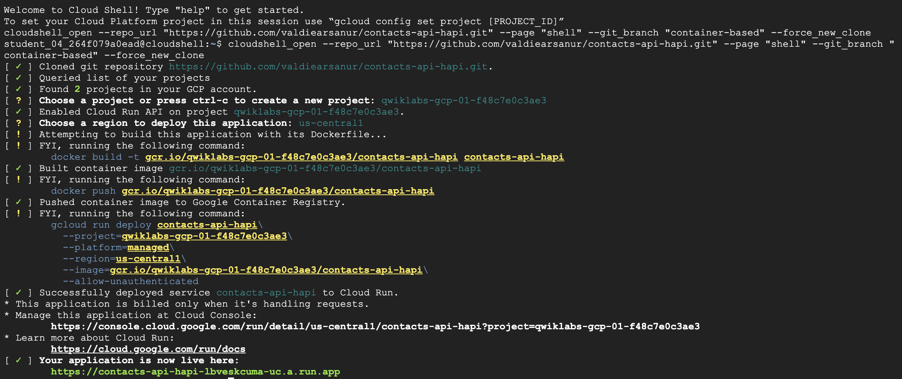

# Contacts BackEnd API Hapi
---

## Prerequisites

### Node >= 12.0

If this is your fist development. We encourage you to use NVM by following the steps on https://github.com/nvm-sh/nvm.


## Frameworks & 3rd party libraries

|No| Name | Version | Description |
|--|--|--|--|
|1.| [**Hapi.js**](https://hapi.dev/) | `20.2.1` | Primary Back End framework. |
|2.| [**standard**](https://github.com/standard/standard/) | `16.0.4` | Dev-only standalone package. JavaScript style guide, linter, and formatter. |
|3.| [**nodemon**](https://github.com/remy/nodemon) | `2.0.15` | Dev-only standalone package. For enabling hot-reloading in local development. |


## Development Guideline

1. Clone this repository `git clone https://github.com/valdiearsanur/contacts-api-bangkit.git`

1. Install the dependencies `npm install`

1. Run the application `npm run start`


## Development (Container-based) Guideline

1. Please follow development guideline beforely.

1. Build the custom image using Docker.

    ```
    docker build . -t contact-api-node16
    ```

    The success indicator could be check on the command output as shown below : 
    ```
    ...
    ---> {HASH_NUMBER}
    Successfully built {HASH_NUMBER}
    Successfully tagged contact-api-node16:latest
    ```

1. Lastly, run the built image using `docker run`. The argument `-p` itself have this format `<local-port>:<container-port>`. Local port means your machine port should be exposed to client (browser). And  container port means that port that should be exposed to your Local.

    ```
    docker run -p 3000:3000 contact-api-node16
    ```

1. [Optional] Running previous command require you to keep the Shell active. You can run the container in a `daemon mode`, means you keep your container run in a backround without worying your Shell is inactive. Just add argument `-d` to perform this mode.

    ```
    docker run -d -p 3000:3000 contact-api-node16
    ```

## Deployment (Production) Guideline
---

1. Provide a server, for instance Compute Engine

1. Install required tools:

    ```
    # Install GIT
    sudo apt-get install git

    # Install NVM
    curl -o- https://raw.githubusercontent.com/nvm-sh/nvm/v0.37.2/install.sh | bash

    # Install Node 15.0.X LTS (via nvm)
    nvm install 15.0.1

    # install PM2 (via npm)
    npm install -g pm2
    ```

1. Clone Repository

    ```
    git clone https://github.com/valdiearsanur/contacts-api-hapi.git
    cd contacts-api-hapi/
    ```

1. In the project, install required packages

    ```
    npm install
    ```

1. Run the server using command below. It will be accessible in `http://INSTANCE_IP:3000`.
Note that in the real cloud VM, it requires you to allow incoming request for port 3000. Next steps we will run the web on standard port 80 so the web will be accessible in `http://INSTANCE_IP` instead of `http://INSTANCE_IP:3000`.
    ```
    HOST=0.0.0.0 PORT=3000 npm run start
    ```

1. We will run the web on standard port 80. Follow steps below : 

    a. Install NGINX `sudo apt install nginx`

    b. setting up the default configuration NGINX `sudo nano /etc/nginx/sites-enabled/default` with configuration below : 

    ```
    server {
        listen 80 default_server;
        listen [::]:80 default_server;
        ...
        location / {
                proxy_pass http://127.0.0.1:3000;
                proxy_set_header X-Forwarded-For $proxy_add_x_forwarded_for;
                proxy_set_header Host $http_host;
        }
        ...
    }
    ```
    c. restart NGINX `sudo service NGINX restart`.

    d. run the app, using localhost instead of 0.0.0.0.

    ```
    HOST=localhost PORT=3000 npm run start
    ```

1. In order to keep the application run in the background, we can use Process Manager (PM2)
    ```
    HOST=localhost PORT=3000 pm2 start index.js --name contact
    ```


## Deployment Google Cloud Run (Container-based)

1. Simply use button below to deploy using cloud run.

    [](https://deploy.cloud.run)

    below is the output : 

    

1. Or you can manually deploy with command below : 

    1. You must have Google Cloud SDK to perform `gcloud` command in your local.

    1. Build and submit the custom image to Google Cloud Build. The image will be available on this URL `gcr.io/[PROJECT-ID]/contacts-api-hapi`
    ```
    gcloud builds submit --tag gcr.io/[PROJECT-ID]/contacts-api-hapi
    ```

    1. Deploy previously built image to Google Cloud Run.
    ```
    gcloud run deploy contacts-api-hapi\
        --project=[PROJECT-ID]\
        --platform=managed\
        --region=us-central1\
        --image=gcr.io/[PROJECT-ID]/contacts-api-hapi
    ```
